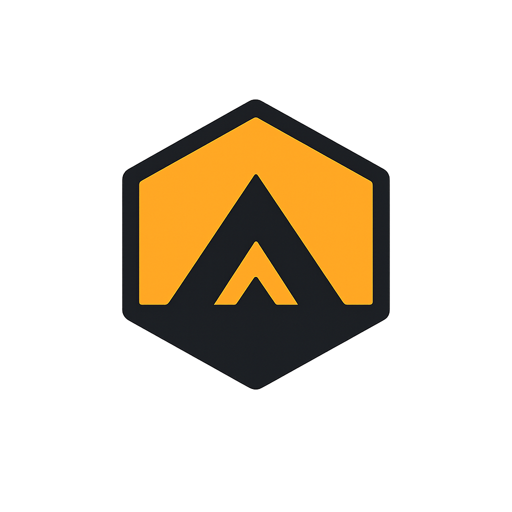

<p align="center">
  
</p>

<h1 align="center">Alpha Hive</h1>

<p align="center">
  <b>Your AI research hive for the stock market.</b><br />
  Ask about any Indian or global stock in plain English — a hive of specialist AI
  agents researches it and hands you a clear, reasoned answer.
</p>

---

## What is Alpha Hive?

Alpha Hive is a **chat-first stock research assistant**. Instead of one AI guessing,
a team of specialist agents each studies a different angle — the fundamentals, the
charts, the news mood, the risk, and the bear case — then a lead agent weighs them all
and gives you a straight, honest answer. You can watch them work in real time.

Add your **Groww portfolio** (optional) and the hive tailors its research to what you
actually own.

> Alpha Hive is a research tool, **not** a SEBI‑registered investment adviser. It’s here
> to help you think, not to tell you what to buy. Always verify before you invest.

---

## Why people use it

- 🐝 **A whole team, not one opinion** — fundamentals, technicals, news‑sentiment, risk,
  and a dedicated *bear* who argues the other side so you don’t get one‑sided answers.
- 🔍 **See the reasoning** — watch each agent run live, then expand **“Analyst views”** to
  read every specialist’s rating and rationale. No black box.
- 📊 **Portfolio‑aware** — import your Groww holdings and ask “Am I too concentrated?” or
  “Does this stock fit my portfolio?” and get answers grounded in what you own.
- 🇮🇳 **Built for Indian markets first** — proper NSE/BSE coverage, with global stocks too.
- 💬 **Just chat** — no dashboards to learn. Ask a question, get a researched answer with
  tables, charts, and clear verdicts.

---

## Meet the hive

When you ask a question, here’s what happens:

```
        You ask a question
                │
        🧭 Supervisor  ── plans the work (and reads your portfolio)
                │
   ┌──────┬─────┼──────┬──────┐
   │      │     │      │      │
  📊     📈    📰     ⚠️     🐻      ← specialists research in parallel
 Funda-  Tech- News/  Risk   Bear
mentals  nical Sent.        (counter-case)
   └──────┴─────┼──────┴──────┘
                │
        🐝 Lead agent  ── weighs every view, notes where they agree/disagree,
                          and streams you the final decision
```

For portfolio questions, a **🏥 Portfolio Doctor** agent joins in to diagnose your
holdings — concentration, sector gaps, risk, and what to rebalance.

Every agent has its own **tools** (live quotes, technical indicators, news, risk metrics,
SEC filings, your portfolio). Adding a new capability is as simple as giving an agent a
new tool — the hive grows without a rewrite.

---

## What you can ask

- *“Should I buy Reliance right now?”*
- *“What’s the technical outlook for TCS?”*
- *“Analyze my portfolio.”*
- *“Am I too concentrated in any one sector?”*
- *“Is Infosys a good long‑term hold?”*
- *“What is a P/E ratio?”* (general questions get a direct answer — no over‑analysis)

---

## Add your Groww portfolio (optional)

Two easy ways, both optional — Alpha Hive works fully without a portfolio:

1. **Official Groww API** — paste a daily access token from Groww’s Trading APIs page.
2. **Upload a statement** — export your Holdings/P&L from Groww (CSV or Excel) and drop
   the file in. No subscription needed.

Once imported, the hive researches every question in the context of what you hold.

---

## Quickstart (local)

You'll need **Python 3.11+**, **Node 22+**, **Docker**, a **Supabase** project,
and an LLM proxy key. Full config lives in [`.env.example`](.env.example).

```bash
# 1. Copy the env template and fill in your keys
cp .env.example .env

# 2. Install, migrate, and start everything
./build
```

Two values you must set in `.env`:

- **`SECRET_KEY`** — signs the session cookie.
  Generate one with `python -c "import secrets; print(secrets.token_urlsafe(48))"`
- **`DATABASE_URL`** — from Supabase → Project Settings → Database → Connection
  string → URI, with `postgresql://` swapped for `postgresql+asyncpg://`

Open **http://localhost:3000** and ask it something. 🎉

`./build` is the only command you need. It also takes `setup`, `services`,
`test`, and `stop` if you want to run a step on its own. Works in PowerShell,
Git Bash, and on macOS/Linux.

Postgres runs on Supabase, so nothing local. Docker is only for Redis.

You can use Alpha Hive without an account. Signing up keeps whatever you've
already done and makes it reachable from any device; **Account** lets you export
or delete everything.

---

## Under the hood

| | |
|---|---|
| **Agents** | [LangGraph](https://github.com/langchain-ai/langgraph) — a supervisor graph of tool‑calling agents |
| **Models** | Any provider via a LiteLLM proxy (swap models with env vars, no code changes) |
| **Backend** | FastAPI + async SQLAlchemy, streaming answers over SSE |
| **Frontend** | Next.js 15 + React 19, Tailwind |
| **Auth** | Email + password, signed httpOnly session cookie |
| **Data** | Supabase Postgres — accounts, chat, portfolio, and SEC filing search via pgvector · Redis — cache, live streaming |
| **Market data** | Yahoo/BSE (India‑first), Finnhub & Twelve Data (global), Marketaux (news) |

```
backend/app/
  agents/          # the hive: supervisor, specialists, tools, the chat graph
    specialists.py #   agent definitions (fundamentals, bear, portfolio doctor…)
    chat_nodes.py  #   how each agent runs + streams its status/verdict
    graph.py       #   wires the supervisor → specialists → final answer
    tools/         #   each data source as an agent tool (the extension point)
  api/v1/endpoints/# auth, chat, portfolio, stocks, indicators, sec, reports
  core/            # config, session identity + ownership guards, rate limiting
  services/        # market data, news, portfolio, Groww import, LLM client, SEC index
  models/          # SQLAlchemy tables    schemas/  # Pydantic request/response types
  alembic/         # migrations — one per schema change, always reversible
frontend/
  app/             # routes: landing, chat, portfolio, account, login/signup
  components/      # chat UI, agent trace panel, layout shell, ui primitives
  hooks/           # useChatSession — SSE stream, resume, optimistic messages
  services/api.ts  # the single typed client for every backend call
```

---

## Deploy

Alpha Hive deploys as **two long-running containers** (see
[`docker-compose.yml`](docker-compose.yml)) on any Docker host — Fly.io, Render,
Railway, a VPS. Postgres is Supabase; Redis runs alongside.

```bash
cp .env.example .env      # fill in DATABASE_URL, SECRET_KEY, CORS_ORIGINS, API keys
docker compose build
docker compose up -d
docker compose exec backend python -m alembic -c alembic.ini upgrade head
curl http://localhost:8000/api/v1/health
```

Set `ENVIRONMENT=production`, a strong `SECRET_KEY`, and `CORS_ORIGINS` to your
exact origin — the app refuses to boot without them. Work through
[`docs/RELEASE_CHECKLIST.md`](docs/RELEASE_CHECKLIST.md) before going live.

> **Not serverless.** An agent run is an in-process `asyncio` task that outlives
> the HTTP request that started it, and the SSE stream stays open for its
> duration. A platform that freezes the instance after a response (Vercel
> Functions, Lambda) will kill runs mid-flight. The backend needs a process that
> keeps running; the frontend alone would deploy anywhere.

---

## Disclaimer

Alpha Hive provides **educational research and analysis only**. It is not investment
advice and not a substitute for a registered financial adviser. Markets carry risk;
you are responsible for your own decisions. Always do your own verification.
